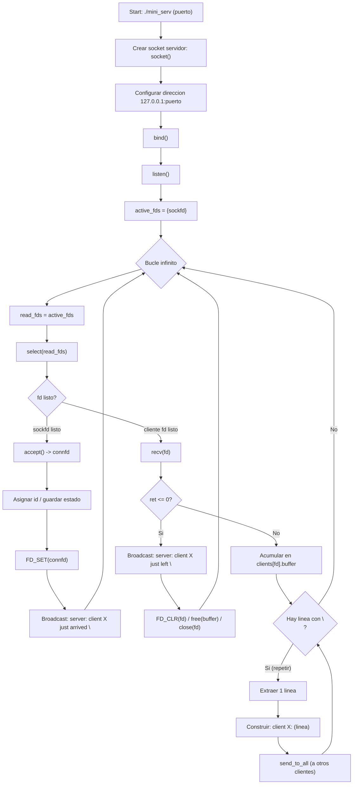

# 🖥️ Mini Serv - Servidor de Chat

## Navegación
- Guía paso a paso (solution): [`solution/README.md`](solution/README.md)

## 📋 Información del Ejercicio

| Campo | Valor |
|-------|-------|
| **Nombre** | mini_serv |
| **Archivo esperado** | mini_serv.c |

## 📚 Funciones Permitidas

```
write, close, select, socket, accept, listen, send, recv, 
bind, strstr, malloc, realloc, free, calloc, bzero, atoi, 
sprintf, strlen, exit, strcpy, strcat, memset
```

---

## 📝 Descripción

Escribe un programa que escuche conexiones de clientes en un puerto específico en **127.0.0.1** y permita que los clientes hablen entre sí.

---

## ⚙️ Requisitos

### 🔧 Argumentos
- El programa tomará como **primer argumento** el puerto en el que escuchar
- Si **no se proporciona argumento**, debe escribir en stderr:
  ```
  Wrong number of arguments\n
  ```
  Y salir con estado **1**

### ❌ Manejo de Errores
- Si una **llamada al sistema** retorna error **antes** de aceptar conexiones:
  ```
  Fatal error\n
  ```
  Escribir en stderr y salir con estado **1**

- Si **no se puede asignar memoria**:
  ```
  Fatal error\n
  ```
  Escribir en stderr y salir con estado **1**

### 🚫 Restricciones
- ❌ El programa **NO debe contener** `#define` de preprocesador
- 🏠 El programa **solo debe escuchar** en `127.0.0.1`
- ⏳ El programa debe ser **no-bloqueante**, pero si un cliente es lento y no lee mensajes, **NO debes desconectarlo**
- 💾 **No se permiten** fugas de memoria ni de file descriptors

### ℹ️ Nota Técnica
> Los file descriptors que recibas ya estarán configurados para que `recv` o `send` bloqueen si no se ha llamado a `select` antes, pero no bloquearán en caso contrario.

---

## 👥 Gestión de Clientes

### 🆕 Cuando un cliente se conecta:
1. Se le asigna un **ID único**:
   - El primer cliente recibe ID `0`
   - Cada nuevo cliente recibe: `último_ID + 1`
2. Se envía un mensaje a **todos los clientes conectados**:
   ```
   server: client %d just arrived\n
   ```
   *(donde `%d` es el ID del cliente)*

### 💬 Mensajes entre clientes:
- Los clientes pueden enviar mensajes al servidor
- Los mensajes solo contendrán **caracteres imprimibles** (no es necesario validar)
- Un mensaje puede contener **múltiples `\n`**
- Cuando el servidor recibe un mensaje, debe **reenviarlo a todos los demás clientes** con el formato:
  ```
  client %d: [mensaje]
  ```
  *(prefijo `"client %d: "` antes de **cada línea**)*

### 👋 Cuando un cliente se desconecta:
- Se envía un mensaje a **todos los clientes conectados**:
  ```
  server: client %d just left\n
  ```

---

## ⚡ Rendimiento

> ⚠️ **Importante**: Nuestro tester espera que envíes los mensajes **tan rápido como sea posible**. No uses buffers innecesarios.

---

## 🧪 Cómo Probar

### 💡 Consejos
- Puedes usar `nc` (netcat) para probar tu programa
- **Deberías** usar `nc` para probar tu programa
- Para pruebas puedes usar `fcntl(fd, F_SETFL, O_NONBLOCK)` pero usa `select` y **NUNCA** compruebes `EAGAIN` (ver `man 2 send`)

### 🚀 Ejemplo de Uso

```bash
# Terminal 1: Iniciar servidor
./mini_serv 8080

# Terminal 2: Cliente 1
nc 127.0.0.1 8080

# Terminal 3: Cliente 2
nc 127.0.0.1 8080

# Terminal 4: Cliente 3
nc 127.0.0.1 8080
```

### 📊 Flujo Esperado

```
[Cliente 1 se conecta]
→ Todos reciben: "server: client 0 just arrived\n"

[Cliente 2 se conecta]
→ Cliente 1 recibe: "server: client 1 just arrived\n"

[Cliente 1 escribe "Hola!\n"]
→ Cliente 2 recibe: "client 0: Hola!\n"

[Cliente 2 se desconecta]
→ Cliente 1 recibe: "server: client 1 just left\n"
```

---

## Diagrama de flujo



---

## 📁 Archivos de Ayuda

Se proporciona el archivo `main.c` con:
- Inicio básico de un servidor
- Algunas funciones útiles

> ⚠️ **Cuidado**: Este archivo usa funciones prohibidas o escribe cosas que no deben estar en tu programa final.

---

## 🔨 Compilación

```bash
gcc -Wall -Wextra -Werror mini_serv.c -o mini_serv
```

---

*¡Buena suerte! 🍀*
