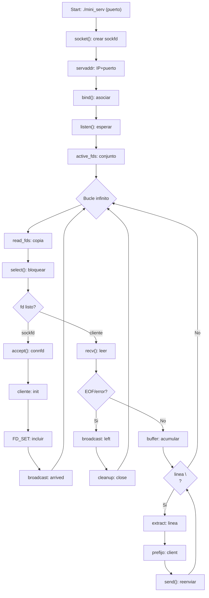

# Mini Serv — Paso a paso “modo diff” (copiar/pegar)

[⬅️ Volver al README del enunciado](../README.md)

## 🧭 Navegación
- [Diagrama de flujo](#diagrama-de-flujo)
- [Paso 1 — Reemplazar los includes](#paso-1)
- [Paso 2 — Mantener extract_message y str_join](#paso-2)
- [Paso 3 — Añadir estructura de cliente + estado global](#paso-3)
- [Paso 4 — Añadir fatal_error](#paso-4)
- [Paso 5 — Añadir broadcast y gestión de clientes](#paso-5)
- [Paso 6 — Añadir el procesamiento de datos](#paso-6)
- [Paso 7 — Reemplazar TODO el main()](#paso-7)
- [Paso 8 — Resultado](#paso-8)

---

<a id="diagrama-de-flujo"></a>
## Diagrama de flujo



Este documento te guía desde `files/main.c` (archivo base del enunciado) hasta una solución completa tipo `solution/mini_serv.c`, usando bloques **ANTES / DESPUÉS** listos para copiar y pegar.

> Nota: el archivo `files/main.c` del subject es un ejemplo (usa funciones prohibidas como `printf`). En tu `mini_serv.c` final solo deben quedar las funciones permitidas y los mensajes exactos del subject.

---

<a id="paso-1"></a>
## Paso 1 — Reemplazar los includes (añadir lo que falta)

### ANTES (`files/main.c`)
```c
#include <errno.h>
#include <string.h>
#include <unistd.h>
#include <netdb.h>
#include <sys/socket.h>
#include <netinet/in.h>
```

### DESPUÉS (equivalente a la solución)
```c
#include <errno.h>
#include <netdb.h>
#include <string.h>
#include <unistd.h>
#include <sys/socket.h>
#include <netinet/in.h>
#include <sys/select.h>
#include <stdlib.h>
#include <stdio.h>
```

Qué has hecho:
- **Añadir**: `<sys/select.h>`, `<stdlib.h>`, `<stdio.h>`.
- Mantener: los headers de sockets y strings.

### Explicación “para tontos” (qué aporta cada include)
- `<sys/socket.h>` y `<netinet/in.h>`: son *lo mínimo* para crear sockets TCP y trabajar con `struct sockaddr_in`.
- `<sys/select.h>`: trae `select()` y las macros de `fd_set` (`FD_ZERO`, `FD_SET`, `FD_CLR`, `FD_ISSET`). Sin esto no puedes vigilar “muchos clientes a la vez” con `select`.
- `<stdlib.h>`: trae `malloc/calloc/free`, `atoi` y `exit`.
- `<stdio.h>`: trae `sprintf` (para construir mensajes tipo `server: client 3 just arrived\n`).
- `<string.h>`: trae `strlen`, `strcpy`, `strcat`, `bzero`.
- `<unistd.h>`: trae `write` (para imprimir errores al stderr) y `close`.

En resumen: este paso no cambia la lógica del programa, solo hace posible compilar lo que vendrá después.

---

<a id="paso-2"></a>
## Paso 2 — Mantener `extract_message` y `str_join` (helpers del subject)

### Qué problema resuelven estas 2 funciones
En TCP no existen “mensajes”: existe un flujo de bytes. Eso implica:
- Un `recv()` puede devolverte media línea (`hol`), y el siguiente `recv()` el resto (`a\n`).
- O un `recv()` puede devolverte varias líneas a la vez (`hola\nque tal\n`).

Así que necesitas:
- **Acumular** lo que llega (aunque venga partido) → `str_join`.
- **Sacar líneas completas** terminadas en `\n` → `extract_message`.

### `extract_message`: qué hace exactamente
- Entrada: `*buf` (texto acumulado del cliente, puede tener 0, 1 o muchas líneas).
- Busca el primer `\n`.
- Si lo encuentra:
	- “Corta” la primera línea (incluye el `\n`) y la devuelve en `*msg`.
	- Lo que queda después del `\n` lo copia a un buffer nuevo y lo deja como `*buf`.
- Si no lo encuentra, devuelve 0 y deja `*buf` igual.

Valores de retorno:
- `1`: encontró una línea completa y la devolvió en `*msg`.
- `0`: todavía no hay `\n` (línea incompleta).
- `-1`: falló al reservar memoria.

### `str_join`: qué hace exactamente
- Construye un string nuevo con: `buf + add`.
- Copia lo viejo, libera lo viejo, y devuelve el nuevo.
- Se usa para ir pegando lo que llega por `recv` al “buffer pendiente” del cliente.

### extract_message (Función incluida con el enunciado del ejercicio)
```c
int extract_message(char **buf, char **msg)
{
	char	*newbuf;
	int	i;

	*msg = 0;
	if (*buf == 0)
		return (0);
	i = 0;
	while ((*buf)[i])
	{
		if ((*buf)[i] == '\n')
		{
			newbuf = calloc(1, sizeof(*newbuf) * (strlen(*buf + i + 1) + 1));
			if (newbuf == 0)
				return (-1);
			strcpy(newbuf, *buf + i + 1);
			*msg = *buf;
			(*msg)[i + 1] = 0;
			*buf = newbuf;
			return (1);
		}
		i++;
	}
	return (0);
}
```

### str_join (Función incluida con el enunciado del ejercicio)
```c
char *str_join(char *buf, char *add)
{
	char	*newbuf;
	int		len;

	if (buf == 0)
		len = 0;
	else
		len = strlen(buf);
	newbuf = malloc(sizeof(*newbuf) * (len + strlen(add) + 1));
	if (newbuf == 0)
		return (0);
	newbuf[0] = 0;
	if (buf != 0)
		strcat(newbuf, buf);
	free(buf);
	strcat(newbuf, add);
	return (newbuf);
}
```

---

<a id="paso-3"></a>
## Paso 3 — Añadir estructura de cliente + estado global

### AÑADIR (justo después de los helpers)
```c
typedef struct s_client {
	int		id;
	char	*buffer;
} t_client;

t_client	clients[65536];
int			next_id = 0;
int			max_fd = 0;
int			sockfd;
fd_set		read_fds, active_fds;
```

### Explicación “para tontos” (qué guarda cada cosa)
- `t_client`: la “ficha” de un cliente.
	- `id`: el número que se le asigna (0, 1, 2...).
	- `buffer`: texto acumulado que todavía no se ha convertido en líneas.

- `clients[65536]`: un array para guardar `t_client` usando el **fd como índice**.
	- Si el socket del cliente es fd=42, su estado está en `clients[42]`.

- `next_id`: contador para dar IDs únicos.
- `sockfd`: fd del socket servidor (el que hace `listen`).
- `max_fd`: el fd más alto que estamos vigilando.
	- `select()` necesita `max_fd + 1` para saber hasta dónde mirar.

- `active_fds`: “lista maestra” de fds que queremos vigilar.
	- Dentro van `sockfd` y todos los fds de clientes.
- `read_fds`: copia temporal.
	- Importante: `select()` **modifica** el `fd_set` que le pasas (te deja marcados solo los que están listos). Por eso siempre se hace `read_fds = active_fds` antes de llamar a `select`.

---

<a id="paso-4"></a>
## Paso 4 — Añadir `fatal_error`

### AÑADIR
```c
void	fatal_error(void)
{
	write(2, "Fatal error\n", 12);
	exit(1);
}
```

### Explicación
- `write(2, ..., 12)`: escribe en el **stderr** (fd 2). El subject pide esos errores por stderr.
- El `12` es la longitud de la cadena `"Fatal error\n"`.
- `exit(1)`: termina el programa con código de error.

Por qué existe: para cumplir el subject con un mensaje exacto y para no repetir el mismo bloque por todo el código.

---

<a id="paso-5"></a>
## Paso 5 — Añadir broadcast y gestión de clientes

### AÑADIR: `send_to_all`
```c
void send_to_all(int sender_fd, char *msg)
{
	for (int fd = 0; fd <= max_fd; fd++)
	{
		if (FD_ISSET(fd, &active_fds) && fd != sender_fd && fd != sockfd)
			send(fd, msg, strlen(msg), 0);
	}
}
```

### `send_to_all`: qué hace línea por línea
- Recorre `fd = 0 .. max_fd` porque en Linux los fds son números pequeños crecientes.
- `FD_ISSET(fd, &active_fds)`: “¿este fd está en la lista de activos?”
- `fd != sender_fd`: no le devuelvas el mensaje al que lo envió.
- `fd != sockfd`: no intentes hacer `send` al socket servidor (no es un cliente).
- `send(fd, msg, strlen(msg), 0)`: manda bytes por el socket.

`send()` devuelve cuántos bytes mandó o -1 si error. Esta solución no lo comprueba (simplificación habitual en este ejercicio, porque los mensajes son pequeños).

### AÑADIR: `remove_client`
```c
void remove_client(int fd)
{
	char msg[64];

	sprintf(msg, "server: client %d just left\n", clients[fd].id);
	send_to_all(fd, msg);

	FD_CLR(fd, &active_fds);
	if (clients[fd].buffer)
		free(clients[fd].buffer);
	clients[fd].buffer = NULL;
	clients[fd].id = -1;
	close(fd);
}
```

### `remove_client`: qué hace y por qué
1) Construye el mensaje de salida:
- `sprintf(msg, "server: client %d just left\n", clients[fd].id);`
2) Avisa a todos:
- `send_to_all(fd, msg);`
3) Lo elimina de `select`:
- `FD_CLR(fd, &active_fds);`
4) Limpia memoria:
- `free(clients[fd].buffer);` si existía.
5) Limpia estado:
- `id = -1`, `buffer = NULL`.
6) Cierra el socket:
- `close(fd);`

Esto evita “fugas” de fds (muy importante en el subject).

### AÑADIR: `add_client`
```c
void add_client(int connfd)
{
	clients[connfd].id = next_id++;
	clients[connfd].buffer = NULL;

	if (connfd > max_fd)
		max_fd = connfd;

	FD_SET(connfd, &active_fds);

	char msg[64];
	sprintf(msg, "server: client %d just arrived\n", clients[connfd].id);
	send_to_all(connfd, msg);
}
```

### `add_client`: qué hace y por qué
1) Asigna un ID único:
- `clients[connfd].id = next_id++;`
2) Inicializa su buffer:
- `clients[connfd].buffer = NULL;`
3) Actualiza el máximo fd:
- si `connfd` es el número más alto, `max_fd = connfd`.
4) Lo mete en la lista de `select`:
- `FD_SET(connfd, &active_fds);`
5) Avisa a los demás:
- construye `server: client X just arrived\n` y `send_to_all(connfd, msg)`.

Ojo: aquí se excluye al propio `connfd`, por eso si solo conectas 1 cliente con `nc` no verás el mensaje de “arrived” en ese mismo `nc`.

---

<a id="paso-6"></a>
## Paso 6 — Añadir el procesamiento de datos: `handle_client_data`

### AÑADIR
```c
void handle_client_data(int fd)
{
	char buffer[65536];
	char *msg;
	int ret;

	ret = recv(fd, buffer, sizeof(buffer) - 1, 0);
	if (ret <= 0)
	{
		remove_client(fd);
	}
	else
	{
		buffer[ret] = '\0';
		clients[fd].buffer = str_join(clients[fd].buffer, buffer);
		if (clients[fd].buffer == NULL)
			fatal_error();

		while (extract_message(&clients[fd].buffer, &msg) == 1)
		{
			char *full_msg;
			int len;

			len = strlen(msg) + 32;
			full_msg = malloc(len);
			if (!full_msg)
				fatal_error();

			sprintf(full_msg, "client %d: %s", clients[fd].id, msg);
			send_to_all(fd, full_msg);
			free(full_msg);
			free(msg);
		}
	}
}
```

### `handle_client_data`: qué hace (lo importante)

#### 1) Leer del socket
- `recv(fd, buffer, sizeof(buffer) - 1, 0)` intenta leer bytes del cliente.
- `ret`:
	- `> 0`: llegaron bytes.
	- `== 0`: el cliente cerró la conexión (EOF).
	- `< 0`: error.

Si `ret <= 0`, se considera que el cliente ya no está y se llama a `remove_client(fd)`.

#### 2) Convertir lo leído en string C
`buffer[ret] = '\0';` mete el terminador nulo para poder usar funciones de string como `strcat/strlen`.

#### 3) Acumular lo nuevo
`clients[fd].buffer = str_join(clients[fd].buffer, buffer);`
- Si antes había texto pendiente, lo pega.
- Si no, crea el buffer desde cero.

#### 4) Sacar líneas completas
El bucle:
```c
while (extract_message(&clients[fd].buffer, &msg) == 1)
```
significa: “mientras haya una línea completa (acabada en `\n`), sácala y procésala”.

#### 5) Construir el mensaje que verán los demás
```c
sprintf(full_msg, "client %d: %s", clients[fd].id, msg);
```
Esto pone el prefijo `client X: ` antes de la línea.

#### 6) Mandar y liberar
- `send_to_all(fd, full_msg);`
- `free(full_msg);`
- `free(msg);`

### Por qué se hace `strlen(msg) + 32`
`msg` es la línea del cliente. A eso le añades texto extra (`client ` + id + `: ` + `\0`). El `+32` es un margen fijo para que quepa.

---

<a id="paso-7"></a>
## Paso 7 — Reemplazar TODO el `main()` del base por el `main()` con select

### ANTES (`files/main.c`)
```c
int main() {
	int sockfd, connfd, len;
	struct sockaddr_in servaddr, cli; 

	// socket create and verification 
	sockfd = socket(AF_INET, SOCK_STREAM, 0); 
	if (sockfd == -1) { 
		printf("socket creation failed...\n"); 
		exit(0); 
	} 
	else
		printf("Socket successfully created..\n"); 
	bzero(&servaddr, sizeof(servaddr)); 

	// assign IP, PORT 
	servaddr.sin_family = AF_INET; 
	servaddr.sin_addr.s_addr = htonl(2130706433); //127.0.0.1
	servaddr.sin_port = htons(8081); 
  
	// Binding newly created socket to given IP and verification 
	if ((bind(sockfd, (const struct sockaddr *)&servaddr, sizeof(servaddr))) != 0) { 
		printf("socket bind failed...\n"); 
		exit(0); 
	} 
	else
		printf("Socket successfully binded..\n");
	if (listen(sockfd, 10) != 0) {
		printf("cannot listen\n"); 
		exit(0); 
	}
	len = sizeof(cli);
	connfd = accept(sockfd, (struct sockaddr *)&cli, &len);
	if (connfd < 0) { 
        printf("server acccept failed...\n"); 
        exit(0); 
    } 
    else
        printf("server acccept the client...\n");
}
```

### DESPUÉS (equivalente a la solución)
```c
int	main(int argc, char **argv)
{
	int					connfd;
	socklen_t			len;
	struct sockaddr_in	servaddr, cli;

	if (argc != 2)
	{
		write(2, "Wrong number of arguments\n", 26);
		exit(1);
	}

	sockfd = socket(AF_INET, SOCK_STREAM, 0);
	if (sockfd == -1)
		fatal_error();

	max_fd = sockfd;
	FD_ZERO(&active_fds);
	FD_SET(sockfd, &active_fds);

	bzero(&servaddr, sizeof(servaddr));
	servaddr.sin_family = AF_INET;
	servaddr.sin_addr.s_addr = htonl(2130706433);
	servaddr.sin_port = htons(atoi(argv[1]));

	if (bind(sockfd, (const struct sockaddr *)&servaddr, sizeof(servaddr)) != 0)
		fatal_error();
	if (listen(sockfd, 128) != 0)
		fatal_error();

	for (int i = 0; i < 65536; i++)
	{
		clients[i].id = -1;
		clients[i].buffer = NULL;
	}

	while (1)
	{
		read_fds = active_fds;
		if (select(max_fd + 1, &read_fds, NULL, NULL, NULL) < 0)
			continue;
		for (int fd = 0; fd <= max_fd; fd++)
		{
			if (FD_ISSET(fd, &read_fds))
			{
				if (fd == sockfd)
				{
					len = sizeof(cli);
					connfd = accept(sockfd, (struct sockaddr *)&cli, &len);
					if (connfd >= 0)
						add_client(connfd);
				}
				else
					handle_client_data(fd);
			}
		}
	}
	return (0);
}
```

Qué cambió aquí:
- **BORRADO**: prints con `printf` y `exit(0)`.
- **AÑADIDO**: validación de argumentos, `select`, bucle infinito, `accept` en el socket servidor.
- **MODIFICADO**: el puerto ahora viene de `argv[1]`.

### Explicación del `main` nuevo (qué hace cada llamada)

#### 1) Comprobar argumentos
- `argc != 2` → el subject exige imprimir `Wrong number of arguments\n` en stderr y salir con 1.

#### 2) `socket(AF_INET, SOCK_STREAM, 0)`
- Crea un socket TCP IPv4.
- Devuelve un fd (un número). Si devuelve `-1`, falló.

#### 3) Preparar `select`
- `FD_ZERO(&active_fds)`: vacía el conjunto.
- `FD_SET(sockfd, &active_fds)`: mete el socket servidor para poder detectar nuevas conexiones.
- `max_fd = sockfd`: el máximo fd vigilado arranca siendo el del servidor.

#### 4) Preparar la dirección (`servaddr`)
- `bzero(&servaddr, sizeof(servaddr))`: deja la estructura a 0.
- `sin_family = AF_INET`: IPv4.
- `sin_addr.s_addr = htonl(2130706433)`: fija la IP a `127.0.0.1`.
- `sin_port = htons(atoi(argv[1]))`: convierte el puerto a entero y luego a orden de red.
  - `atoi`: string → int.
  - `htons`: host → network (para puertos).

#### 5) `bind()` y `listen()`
- `bind(sockfd, ...)`: “pega” el socket a esa IP:puerto.
- `listen(sockfd, 128)`: pone el socket en modo servidor y crea cola de pendientes.

#### 6) Inicializar el array de clientes
Se pone `id = -1` y `buffer = NULL` para que el estado inicial sea “no conectado”.

#### 7) Bucle infinito del servidor
Cada vuelta:
1) `read_fds = active_fds;`
	- Copia el conjunto maestro.
2) `select(max_fd + 1, &read_fds, NULL, NULL, NULL)`
	- Se bloquea hasta que haya *algún fd listo para leer*.
	- Cuando vuelve, `read_fds` queda con los fds “marcados”.
3) Recorre `fd = 0..max_fd` y pregunta `FD_ISSET(fd, &read_fds)`.
	- Si `fd == sockfd`: hay una conexión entrante → `accept()`.
	  - `accept()` devuelve `connfd` (fd nuevo del cliente).
	  - Luego `add_client(connfd)` lo mete en el chat.
	- Si no: es un cliente con datos → `handle_client_data(fd)`.

#### 8) `accept()` y `socklen_t len`
- `len = sizeof(cli)` le dice a `accept` cuánto espacio tiene `cli`.
- `accept(..., (struct sockaddr *)&cli, &len)` rellena la IP/puerto del cliente en `cli`.

---

<a id="paso-8"></a>
## Paso 8 — Resultado

Si aplicas los pasos anteriores, tu archivo pasa de “un cliente y prints” a:
- servidor multi-cliente (`select`),
- mensajes de llegada/salida,
- y reenvío por líneas.

Siguiente mejora opcional (no necesaria para que funcione): ajustar `max_fd` a la baja cuando se desconecta el cliente con el fd más alto.

### Recordatorio de prueba manual
Para ver mensajes, usa 2 terminales con `nc` (porque `send_to_all` no reenvía al emisor):
```bash
./mini_serv 8081
nc 127.0.0.1 8081
nc 127.0.0.1 8081
```

---

[⬅️ Volver al README del enunciado](../README.md)
